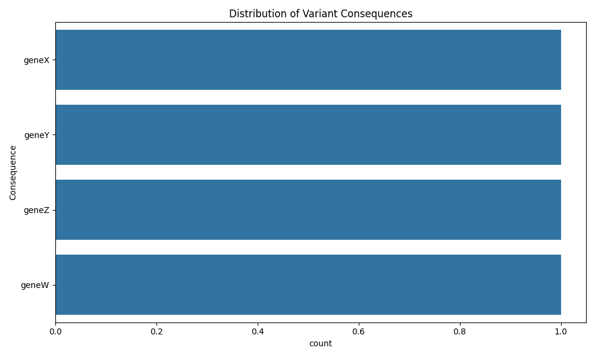
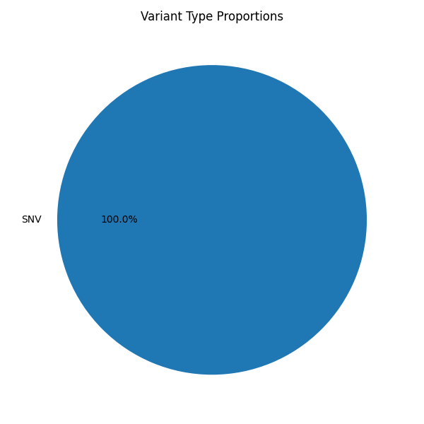

# PlantVarFilter

**PlantVarFilter** is a Python-based toolkit for filtering, annotating, and analyzing plant genomic variants (VCF), linking them with gene annotations (GFF3) and trait scores for basic GWAS analysis. The package provides an end-to-end command-line pipeline for plant genomics researchers.

> ⚠️ Requires **Python 3.12+**
> **Current Version: 0.1.0** — This is the first stable release.
> In future versions, PlantVarFilter aims to evolve into a revolutionary tool in agricultural genomics and trait-linked variant discovery, with support for advanced statistical models, automated reports, and real-time interactive visualization.


---

## Features:

- Filter variants by consequence type (missense, stop_gained, etc.)
- Include/exclude intergenic regions
- Annotate variants with genes using GFF3
- Link genes with trait scores
- Perform basic GWAS (t-test based)
- Generate summary plots (count plots, pie charts, Manhattan plot)
- Configurable output format: CSV, TSV, JSON, XLSX, Feather

---

## Project Structure

```
PlantVarFilter/
├── src/
│   └── plantvarfilter/
│       ├── __init__.py
│       ├── annotator.py
│       ├── cli.py
│       ├── filter.py
│       ├── parser.py
│       └── visualize.py
├── setup.py
├── README.md
└── LICENSE
```

---

## Installation

```bash
pip install .
```

Make sure the following dependencies are installed:
`pandas`, `pyarrow`, `scipy`, `seaborn`, `matplotlib`, `numpy`.

---

## Usage

### Initialize a new analysis project

```bash
plantvarfilter init /desired/path/to/project
```

Creates:
- `input/`: for input data files (VCF, GFF, traits)
- `output/`: for result files and plots
- `config.json`: configuration template

### Run the full pipeline

```bash
plantvarfilter run --config /desired/path/to/project/config.json
```

Performs:
- Filtering of variants
- Gene annotation
- Trait annotation
- Basic GWAS analysis (if enabled)
- Output generation and plots

### Run plotting from existing GWAS result

```bash
plantvarfilter plot-only --config /desired/path/to/project/config.json
```

> Requires config to include:
>
```json
{
  "plot_only": true,
  "output_dir": "output/",
  "gwas_results": "output/gwas_basic_results.csv"
}
```

---

## Configuration File Example (`config.json`)

```json
{
  "vcf": "input/data.vcf.gz",
  "gff": "input/annotation.gff3.gz",
  "traits": "input/traits.csv",
  "include_intergenic": true,
  "consequence_types": [
    "missense_variant",
    "stop_gained",
    "synonymous_variant"
  ],
  "output_format": "csv",
  "output_dir": "output/",
  "plot": true,
  "gwas": true
}
```

---

## Output Files

- `filtered_variants.csv`: Main filtered and annotated variant data
- `gwas_basic_results.csv`: GWAS results (with P-values)
- `plots/` folder contains:
  - `consequence_distribution.png`
  - `variant_type_pie.png`
  - `manhattan_plot.png`
  - `manhattan_plot_from_file.png` (if using `plot-only`)
- `run.log`: Full log of the run

---

##  Example Experiment Walkthrough

```bash
# Step 1: Create the project folder structure
plantvarfilter init ~/Desktop/PlantTestRun

# Step 2: Place your prepared input files in the input folder:
#   - expanded_variants.vcf.gz
#   - expanded_annotations.gff3.gz
#   - expanded_traits.csv

# Step 3: Update the config.json as:

{
  "vcf": "input/expanded_variants.vcf.gz",
  "gff": "input/expanded_annotations.gff3.gz",
  "traits": "input/expanded_traits.csv",
  "include_intergenic": true,
  "consequence_types": ["MODERATE", "HIGH", "LOW", "MODIFIER"],
  "output_format": "csv",
  "output": "output/filtered_variants.csv",
  "plot": true,
  "gwas": true,
  "output_dir": "output/"
}

# Step 4: Run the full pipeline
plantvarfilter run --config ~/Desktop/PlantTestRun/config.json

# Step 5 (optional): If you only want to regenerate the Manhattan Plot from a modified GWAS CSV
{
  "plot_only": true,
  "output_dir": "output/",
  "gwas_results": "output/gwas_basic_results.csv"
}

plantvarfilter plot-only --config ~/Desktop/PlantTestRun/config.json
```

###  Output Example

#### Consequence Distribution


#### Variant Type Pie


#### Manhattan Plot


---

##  Future Enhancements

- Support for advanced GWAS models
- Auto-generated PDF/HTML reports
- Interactive Streamlit-based UI
- REST API
- Unit testing and test datasets

---

## License

MIT License. See `LICENSE` for details.

---

##  Author

- Ahmed Yassin || Computational Biologist
-  ahmedyassin300@outlook.com
